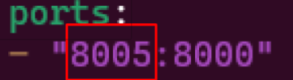

# Guide to Running RAG Using NIM (On-Prem Deployment)

This guide will cover on-prem deployment using NVIDIA Inference Microservice (NIM) to run a simple RAG (NIM: llama3.1 8b instruct, Embedding-MS: nv-embedqa-e5-v5, VectorDB: Milvus). 

## Prerequisites
- Any Linux Distributions
- GenerativeAIExamples v0.8.0
- NVIDIA Container Toolkit
- Docker
- NVIDIA GPU (supported GPU -- refer to [support matrix](https://docs.nvidia.com/nim/large-language-models/latest/support-matrix.html))
- Minimum 2x GPU!

## Steps
1. Git Clone GenerativeAIExamples
```bash
git clone https://github.com/NVIDIA/GenerativeAIExamples.git
cd GenerativeAIExamples
```

2. Get an NVIDIA NGC API Key
- Required to log in to the NVIDIA container registry, nvcr.io, and to pull secure base container images used in the RAG examples. [Guide to generating NGC API KEY](https://docs.nvidia.com/ngc/gpu-cloud/ngc-user-guide/index.html#generating-api-key)
```bash
docker login nvcr.io
```

3. Create a directory to cache the models 
```bash
export NIM_CACHE_PATH=/opt/nim/.cache
mkdir -p $NIM_CACHE_PATH
chmod 755 $NIM_CACHE_PATH
```
- Copy cached model at `/opt/nim/.cache` to local directory e.g. `~/xxx/nim/.cache` (you may skip this step if you have done so previously).

4. Export related environment variables
- Setup env 
```bash
nano .env
```
- export env variables
```bash
export NGC_API_KEY="..."
export MODEL_DIRECTORY=~/xxx/nim/.cache
export APP_LLM_MODELNAME="meta/llama-3.1-8b-instruct"
export APP_LLM_SERVERURL="nemollm-inference:8000"
export APP_EMBEDDINGS_SERVERURL="nemollm-embedding:8000"
```

5. Run llama 3.1 8b instruct (edit config)
docker-compose-nim-ms.yaml (RAG/examples/local_deploy)

 <br>
Change to "llama-3.1-8b-instruct:1.1.2" model

6. Change ports for all services in the 3 yaml with your assigned ports (Only left side) , make sure
other users are not using the same port. *DO THIS FOR ALL SERVICES IN THE .YAML *



- docker-compose.yaml (RAG/examples/basic_rag/langchain)
- docker-compose-nim-ms.yaml (RAG/examples/local_deploy)
- docker-compose-vectordb.yaml (RAG/examples/local_deploy)
<br />

**Rule of thumb for port allocation:** <br>
User 1 = default port number (e.g. 9080)<br>
User 2 = default port number + 1 (e.g. 9081)<br>
User 3 = .... + 2 (e.g. 9082)<br>
User 4 = .... + 3 (e.g. 9083)
... 
(___)


**GPU Allocation** <br>
Due to limited GPU resources, 1 user = 2x GPU.
*if you're using 4xH100 --> user 1 use GPU_ID (0, 1), user 2 use GPU_ID (2, 3)
*if using 2xL40S --> only user 1 use GPU_ID (0, 1)

edit .env file:
```bash
export EMBEDDING_MS_GPU_ID=<your gpu id>
export LLM_MS_GPU_ID=<your gpu id>
```


7. Start the example-specific containers.
```bash
cd RAG/examples/basic_rag/langchain
USERID=$(id -u) GROUPID=$(id -g) docker compose --env-file <.env> --profile local-nim --profile milvus up -d --build
```

8. Confirm all are running!
```bash
docker ps --format "table {{.ID}}\t{{.Names}}\t{{.Status}}
```

9. Run RAG Playground! <br>

## Additional Steps
Stop your work for next user:
Stop and remove the docker containers you've been using:
```
docker compose down
```