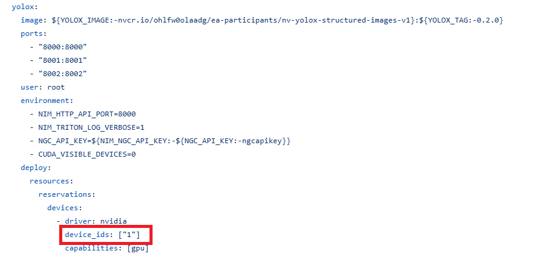

## NIM AI Blueprint (Multimodal Content Extraction / Ingestion)

**Purpose**:
- NV-Ingest is primarily designed for high-performance, scalable extraction of content and metadata from documents like PDFs, Word files, PowerPoint presentations, and images. 

**Processing Pipeline:**
1. Document Splitting: Documents are split into pages.
2. Content Classification: Each page's content is classified (e.g., text, tables, charts, images).
3. Extraction: Relevant content is extracted from each classified element.
4. Contextualization: Extracted content is further processed (e.g., OCR for images).
5. Structuring: All extracted and processed information is organized into a well-defined JSON schema.

### Environment / Hardware
- 2x A100/H100 SXM/NVL or PCIe (80GB)!

## Prerequisites
- Any Linux Distributions
- NVIDIA Container Toolkit
- Docker
- NVIDIA GPU (supported GPU -- refer to [support matrix](https://docs.nvidia.com/nim/large-language-models/latest/support-matrix.html))
- Requires 2x GPUs allocation

## How to run?

### Configuring and Starting Containers
1. Git clone repo and create .env file
```bash
git clone https://github.com/nvidia/nv-ingest 
cd nv-ingest
```
```bash
# NIM_NGC_API_KEY=...
NGC_API_KEY=...<NGC API KEY...>
# NGC_CLI_API_KEY=...
NV_INGEST_ROOT=/home/user/nv-ingest
DATASET_ROOT=/home/user/nv-ingest/data
```

2. Get an NVIDIA NGC API Key
- Required to log in to the NVIDIA container registry, nvcr.io, and to pull secure base container images used in the RAG examples. Guide to generating NGC API KEY
```bash
docker login nvcr.io
```

3. Configure GPU allocation
- Go to nv-ingest/docker-compose.yaml from the cloned repo. 
- Change GPU allocation (e.g. total 4x GPUs, user 1 will use device[0,1], user 2 will use device [2,3], etc) for all services
- As configured in `docker-compose.yml`, YOLOx, Dedplot, Cached NIM are each pinned to a dedicated GPU. (if device_ids is default '1' and you're user 2, +2 to all devices i.e. device 3 instead of 1)


4. Start all services
```bash
docker compose up --build
```
- Remember to run as user: `USERID=$(id -u) GROUPID=$(id -g)`


### Installing Python Dependencies
- Create Python environment
```bash
conda create --name nv-ingest-dev python=3.10
conda activate nv-ingest-dev
```
- Install dependencies
```bash
pip install -r ./requirements.txt #global requirements
cd client
pip install -r ./requirements.txt #client specific requirements
pip install e .
```

### Ingesting Documents
Submit jobs via nv-ingest-cli tool.
- nv-ingest-cli tool:
```bash
nv-ingest-cli \
  --doc ./data/test.pdf \
  --output_directory ./processed_docs \
  --task='extract:{"document_type": "pdf", "extract_method": "pdfium"}' \
  --client_host=localhost \
  --client_port=7670
```
When running the job, you will notice the output indicating document processing status!


### Inspecting and Consuming Results
After the ingestion steps above have completed, you should be able to find text and image subfolders inside your processed docs folder. Each will contain JSON formatted extracted content and metadata.
When processing has completed, you'll have separate result files for `text` and `image` data.

Expected text extracts:
```bash
ls -R processed_docs/
```
```bash
cat ./processed_docs/text/test.pdf.metadata.json
[{
  "document_type": "text",
  "metadata": {
    "content": "Here is one line of text. Here is another line of text. Here is an image.",
    "content_metadata": {
      "description": "Unstructured text from PDF document.",
      "hierarchy": {
        "block": -1,
        "line": -1,
        "page": -1,
        "page_count": 1,
        "span": -1
      },
      "page_number": -1,
      "type": "text"
    },
    "error_metadata": null,
    "image_metadata": null,
    "source_metadata": {
      "access_level": 1,
      "collection_id": "",
      "date_created": "2024-03-11T14:56:40.125063",
      "last_modified": "2024-03-11T14:56:40.125054",
      "partition_id": -1,
      "source_id": "test.pdf",
      "source_location": "",
      "source_name": "",
      "source_type": "PDF 1.4",
      "summary": ""
    },
    "text_metadata": {
      "keywords": "",
      "language": "en",
      "summary": "",
      "text_type": "document"
    }
  }
]]
```

Expected image extracts:
```shell
$ cat ./processed_docs/image/test.pdf.metadata.json
[{
  "document_type": "image",
  "metadata": {
    "content": "<--- Base64 encoded image data --->",
    "content_metadata": {
      "description": "Image extracted from PDF document.",
      "hierarchy": {
        "block": 3,
        "line": -1,
        "page": 0,
        "page_count": 1,
        "span": -1
      },
      "page_number": 0,
      "type": "image"
    },
    "error_metadata": null,
    "image_metadata": {
      "caption": "",
      "image_location": [
        73.5,
        160.7775878906,
        541.5,
        472.7775878906
      ],
      "image_type": "png",
      "structured_image_type": "image_type_1",
      "text": ""
    },
    "source_metadata": {
      "access_level": 1,
      "collection_id": "",
      "date_created": "2024-03-11T14:56:40.125063",
      "last_modified": "2024-03-11T14:56:40.125054",
      "partition_id": -1,
      "source_id": "test.pdf",
      "source_location": "",
      "source_name": "",
      "source_type": "PDF 1.4",
      "summary": ""
    },
    "text_metadata": null
  }
}]
```

### Try your own Document!
Try submitting jobs using your own document, observe the ingestion extraction and output.


### Reference
Based on Agent Blueprint: <https://build.nvidia.com/nvidia/multimodal-pdf-data-extraction-for-enterprise-rag>