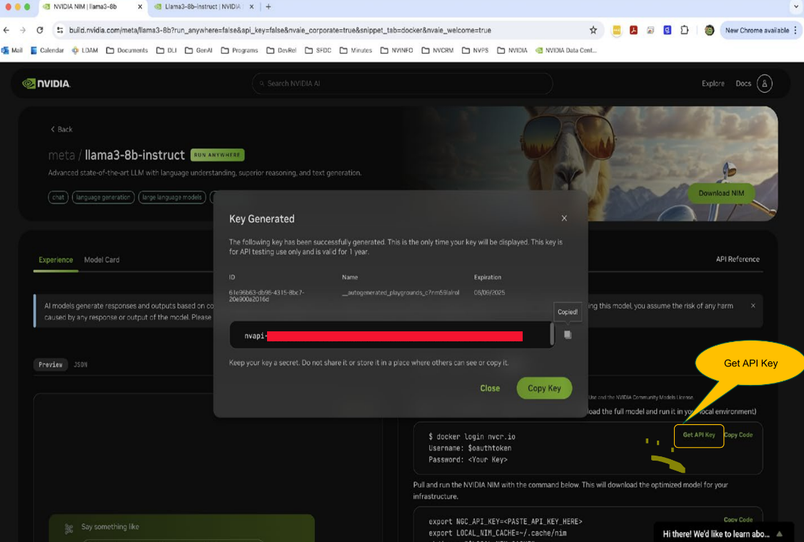
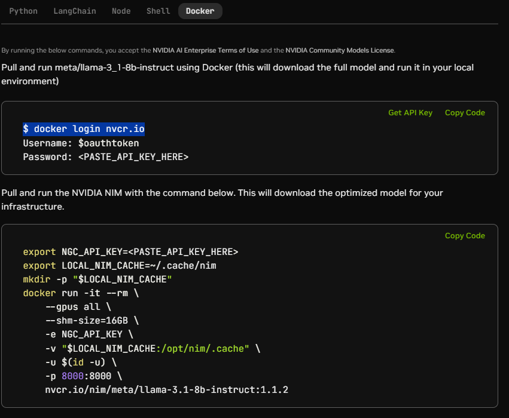
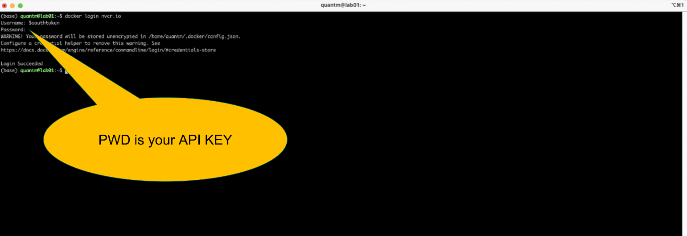
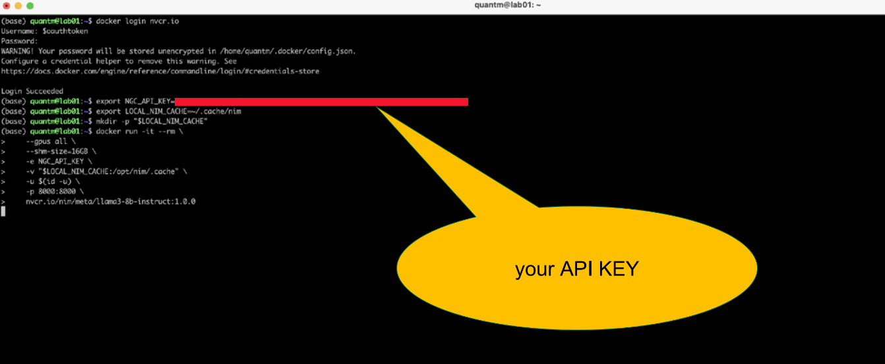
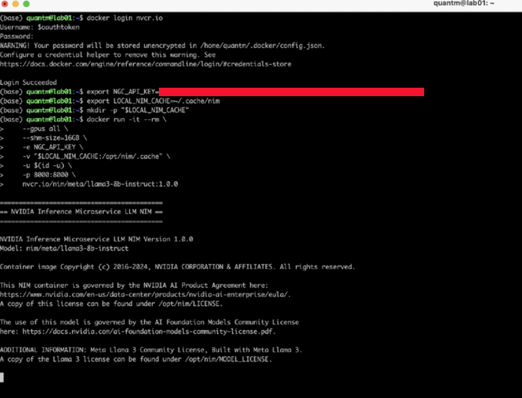
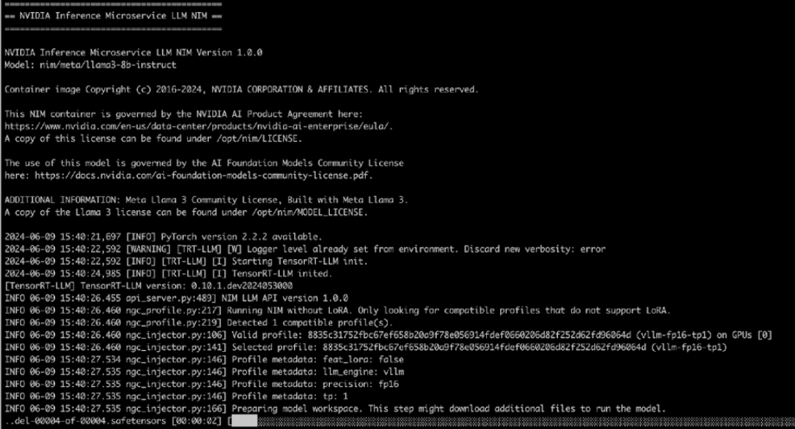
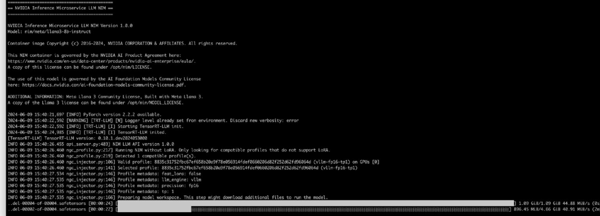
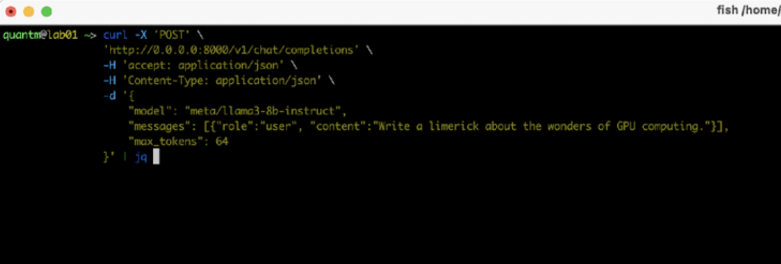
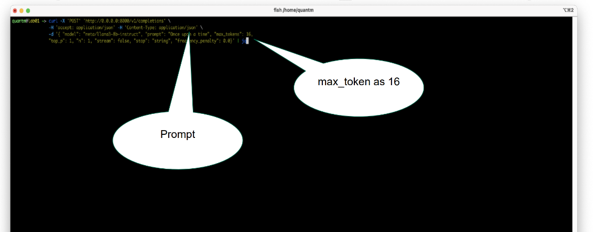
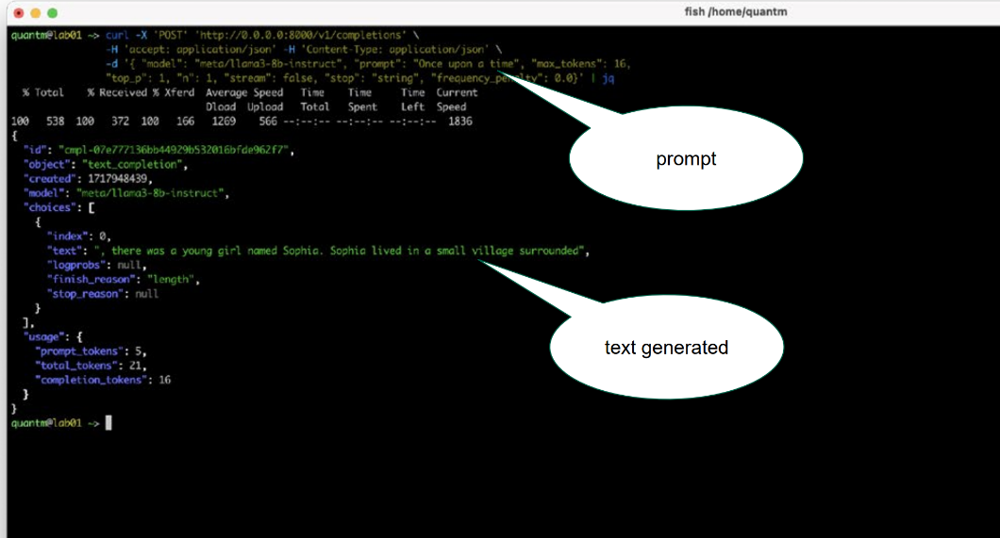

# Deploying NIM model locally


### Prerequisites
1. Any Linux Distributions 
2. Docker
3. NVIDIA Container Toolkit
4. NVIDIA GPU (supported GPU -- refer to [support matrix](https://docs.nvidia.com/nim/large-language-models/latest/support-matrix.html))

### Steps to deploy llama 3.1 8B model
To deploy llama 3.1 8B, you'll require minimum of 1 GPU for this example.
1. **NVIDIA NIM APIs** <br>
Head over to [build.nvidia.com](https://build.nvidia.com/explore/discover) to explore using NIM API. <br>

2. **Get API Key** <br>
 <br>

3. **Try NIM** <br>
Copy the script for local deploy ([llama 3.1 8b](https://build.nvidia.com/meta/llama-3_1-8b-instruct?snippet_tab=Docker)) and edit the following:

- LOCAL_NIM_CACHE -> copy shared cache folder from `/opt/nim/.cache` to `"~/nim/.cache"` (local directory), and set cached folder path as `"~/nim/.cache"`
- GPU allocation -> add line to docker command e.g. --gpus device=0 (use device=0 if you're user 1; device=1 if user 2, etc)
- Port allocation -> user 1 as default port 8000, user 2 as 8001, etc.
- Run as Rootless -> ```-u $(id -u):$(id -g)```





4. **Local API call using curl** <br>











5. **Experiment with Different max_tokens and Prompts** <br>




<br><br>

6. **Experiment with deploying Llama 3.1 70B** <br>
Will require minimum 4x GPU, give it a try! 
- What configuration & profile was selected? (Tell us about it!)


<br><br>

### Run GenAI-Perf Benchmark on your NIM Llama 3.1 8B
Official Documentation: <https://docs.nvidia.com/nim/benchmarking/llm/latest/step-by-step.html>
- prerequisite: You will require HF access to tokenizer `meta-llama/Meta-Llama-3.1-8B-Instruct`
- We will be using `nvcr.io/nvidia/tritonserver:24.08-py3-sdk` container to interface and run the GenAI-Perf Benchmark on our deployed NIM.

1. Ensure you have prepared your User Token and login to huggingface-cli to access tokenizer. (llama-3.1-8b-instruct)
- $`huggingface-cli login`


2. export variables and run Triton Server (NOTE: Ensure your NIM is running)
```bash
export RELEASE="24.06" # recommend using latest releases in yy.mm format
export WORKDIR=<YOUR_GENAI_PERF_WORKING_DIRECTORY>
docker run -it --net=host --gpus=all -v $WORKDIR:/workdir nvcr.io/nvidia/tritonserver:${RELEASE}-py3-sdk
```

3. Create docker network between NIM and Triton Server
```
# EXAMPLE
docker network create hahanet
docker network connect hahanet 4aa9faaff410  # genai-perf
docker network connect hahanet eb625c87fc7d  # endpoint
docker network inspect hahanet | bat -l json -pp
```

4. Run GenAI-Perf (on Triton Server)
```bash
export INPUT_SEQUENCE_LENGTH=200
export INPUT_SEQUENCE_STD=10
export OUTPUT_SEQUENCE_LENGTH=200
export CONCURRENCY=10
export MODEL=meta/llama-3.1-8b-instruct

cd /workdir
genai-perf \
    -m $MODEL \
    --endpoint-type chat \
    --service-kind openai \
    --streaming \
    -u localhost:8000 \
    --synthetic-input-tokens-mean $INPUT_SEQUENCE_LENGTH \
    --synthetic-input-tokens-stddev $INPUT_SEQUENCE_STD \
    --concurrency $CONCURRENCY \
    --output-tokens-mean $OUTPUT_SEQUENCE_LENGTH \
    --extra-inputs max_tokens:$OUTPUT_SEQUENCE_LENGTH \
    --extra-inputs min_tokens:$OUTPUT_SEQUENCE_LENGTH \
    --extra-inputs ignore_eos:true \
    --tokenizer meta-llama/Meta-Llama-3.1-8B-Instruct \
    -- \
    -v \
    --max-threads=256
```


5. Clean up after all containers are done
```bash
# After all container stop, remove the network with one of these options.
docker network rm -f hahanet   # Delete the specific network(s)
docker network prune -f        # Delete all unused networks
docker system prune -f         # Delete all unused stuffs
```

### References
Based on <https://docs.nvidia.com/nim/large-language-models/latest/getting-started.html>.